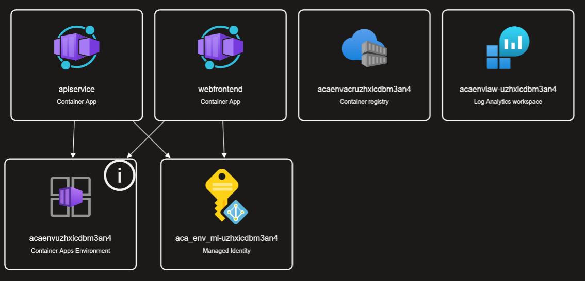
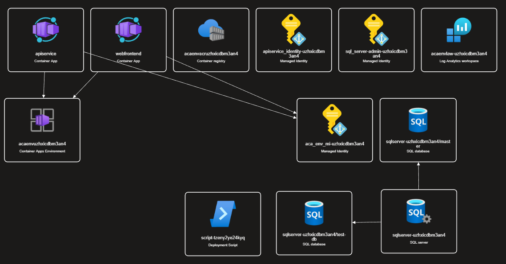

# azd-pipelines-azure-infra


# Setup

Create a solution using the the Aspire Starter App template in Visual Studio.

1. Open Visual Studio and select "Create a new project".
1. Search for "Aspire Starter App" in the project template search box.
1. Select the "Aspire Starter App" template and click "Next".
1. Configure your project details (name, location, etc.) and click "Create".

Here is the official documentation for setting up an Aspire Starter App to use with Azure Developer CLI:
[Aspire Starter App Documentation](https://learn.microsoft.com/en-us/dotnet/aspire/deployment/azd/aca-deployment-github-actions)

NOTE: As of today, there is an `Alpha` warning on this feature.

I am documenting the steps I am taking in order to understand the process and confirm that everything works as documented.

# Step 1: Initialize the Template

On the `azd init` command step, after selecting the `Scan current directory` option, I received the following warning:

```
  Limited mode Warning: Your Aspire project is delegating the services' host infrastructure to azd.
  This mode is limited. You will not be able to manage the host infrastructure from your AppHost. You'll need to use `azd infra gen` to customize the Azure Container Environment and/or Azure Container Apps  See more: https://learn.microsoft.com/dotnet/aspire/azure/configure-aca-environments
```

I cancelled and exited the process so that I could control the environment from Aspire.

# Step 2: Aspire Controlled Infrastructure

At this point you should get yourself familiar with the Aspire documentation. See [Aspire Docs](https://aspire.dev).

Make sure you have the latest version. Things are moving fast a the moment so get in the habit of checking your version.
```bash
aspire --version
```

In order to set up the infrastructure controlled by Aspire, you need to follow the Aspire documentation.

The documentation you are after is in the `Integrations` section in the docs.

I will be setting up my application using [Azure Container Apps (ACA)](https://aspire.dev/integrations/cloud/azure/configure-container-apps/) as the hosting environment.

Use the `aspire add [<integration>] [options]` command to add the integration to your Aspire project. See [Add Integrations](https://aspire.dev/reference/cli/commands/aspire-add/).

To set up Aspire controlled infrastructure, follow these steps:

1. Run the following command: `aspire add Aspire.Hosting.Azure.AppContainers`. This will add the NuGet packages and configuration files needed for ACA.

```text
🗄  Created settings file at '.aspire/settings.json'.
✔  The package Aspire.Hosting.Azure.AppContainers::13.0.2 was added successfully.
```

2. Open the `AppHost.cs` in the `*.AppHost` project. Add the following using statement at the top of the file:

```csharp
var aca = builder.AddAzureContainerAppEnvironment("aca-env");
```

3. Run the init command again: `aspire init`. This time you won't get a warning.

```text
Detected services:

  .NET (Aspire)
  Detected in: C:\Dev\nabs-darrel-schreyer\azd-pipelines-azure-infra\src\AzdPipelinesAzureInfra.AppHost\AzdPipelinesAzureInfra.AppHost.csproj

azd will generate the files necessary to host your app on Azure.
```

I think it would have been nice if it confirmed how it will be hosted. But you can check that for yourself.

Provide the environment name when prompted. I used `testing-azd-pipelines`. See the file `.aspire/config.json` for confirmation.

> NOTE: At this point you can deploy the infrastructure directly to Azure from your local machine. This is great for ephemeral environment testing. However, in this example I want to deploy from GitHub Actions using Azure Developer CLI.

# Step 3: Azd Pipeline Generation and Deployment

Now that we have the Aspire project set up to use ACA, we can generate the pipeline files.

1. Run the following command to generate the pipeline files: `azd pipeline config`. I selected `GiHub` as my pipeline provider.

Here is the full output of the command:

```text
? Select a provider: GitHub

Configure your GitHub pipeline

  (✓) Done: Upgrading Bicep
? Select an Azure Subscription to use:  1. NabsFoundations (XXXXXXXX-XXXX-XXXX-XXXX-XXXXXXXXXXXX)
? Enter a value for the 'location' infrastructure parameter:  5. (Asia Pacific) Australia East (australiaeast)

The default azure-dev.yml file, which contains a basic workflow to help you get started, is missing from your project.

? Would you like to add it now? Yes

The azure-dev.yml file has been created at C:\Dev\nabs-darrel-schreyer\azd-pipelines-azure-infra\.github\workflows\azure-dev.yml. You can use it as-is or modify it to suit your needs.
? This command requires you to be logged into GitHub. Log in using the GitHub CLI? Yes
? What is your preferred protocol for Git operations on this host? HTTPS
? Authenticate Git with your GitHub credentials? Yes
? How would you like to authenticate GitHub CLI? Login with a web browser

! First copy your one-time code: XXXX-XXXX
Press Enter to open https://github.com/login/device in your browser...
✓ Authentication complete.
- gh config set -h github.com git_protocol https
✓ Configured git protocol
? This command requires you to be logged into GitHub. Log in using the GitHub CLI? Yes
? What is your preferred protocol for Git operations on this host? HTTPS
? Authenticate Git with your GitHub credentials? Yes
? How would you like to authenticate GitHub CLI? Login with a web browser

! First copy your one-time code: XXXX-XXXX
Press Enter to open https://github.com/login/device in your browser...
✓ Authentication complete.
- gh config set -h github.com git_protocol https
✓ Configured git protocol
✓ Logged in as nabs-darrel-schreyer
! You were already logged in to this account

  (✓) Done: Checking current directory for Git repository
? Select how to authenticate the pipeline to Azure Federated Service Principal (SP + OIDC)
  (✓) Done: Creating service principal az-dev-XX-XX-XXXX-XX-XX-XX (XXXXXXXX-XXXX-XXXX-XXXX-XXXXXXXXXXXX)
  (✓) Done: Federated identity credential for GitHub: subject repo:nabs-darrel-schreyer/azd-pipelines-azure-infra:pull_request
  (✓) Done: Federated identity credential for GitHub: subject repo:nabs-darrel-schreyer/azd-pipelines-azure-infra:ref:refs/heads/main
  (✓) Done: Setting AZURE_ENV_NAME repo variable
  (✓) Done: Setting AZURE_LOCATION repo variable
  (✓) Done: Setting AZURE_SUBSCRIPTION_ID repo variable
  (✓) Done: Setting AZURE_TENANT_ID repo variable
  (✓) Done: Setting AZURE_CLIENT_ID repo variable
  (✓) Done: Assigning read access role for Key Vault
  (✓) Done: Unchanged AZURE_ENV_NAME repo variable
  (✓) Done: Unchanged AZURE_LOCATION repo variable
  (✓) Done: Setting up project's variables to be used in the pipeline

  GitHub Action secrets are now configured. You can view GitHub action secrets that were created at this link:
  https://github.com/nabs-darrel-schreyer/azd-pipelines-azure-infra/settings/secrets/actions
? Would you like to commit and push your local changes to start the configured CI pipeline? Yes
? Would you like to commit and push your local changes to start the configured CI pipeline? (Y/n)
  (✓) Done: Pushing changes
  (✓) Done: Queuing pipeline

SUCCESS: Your GitHub pipeline has been configured!
Link to view your new repo: https://github.com/nabs-darrel-schreyer/azd-pipelines-azure-infra
Link to view your pipeline status: https://github.com/nabs-darrel-schreyer/azd-pipelines-azure-infra/actions
```

2. After the GitHub Action completed successfully, I was able to see the deployed resources in the Azure Portal. Here is a screenshot of the deployed resources visualisation: 

# Step 4: Add an Azure SQL Database to Aspire

The next step is to add a Azure SQL Database to the Aspire project.

1. Run the following command to add the Azure SQL Database integration: `aspire add azure-sql`.

```text
✔  The package Aspire.Hosting.Azure.Sql::13.0.2 was added successfully.
```

2. Update the `AppHost.cs` file to include the Azure SQL Database service:

```csharp
var sqlServer = builder
    .AddAzureSqlServer("sql-server");

var testDb = sqlServer
    .AddDatabase("test-db");

var apiService = builder.AddProject<Projects.AzdPipelinesAzureInfra_ApiService>("apiservice")
    .WithHttpHealthCheck("/health")
    .WithReference(testDb).WaitFor(testDb);
```

After these changes have been committed, the pipeline has been triggered, and the onfrastructure deployed, the updated resources visualised looks like this:



As you can see no connection strings or secrets stored.

# Step 5: Add Entity Framework DbContext Project

# Step 6: Add PowerShell Script integration


